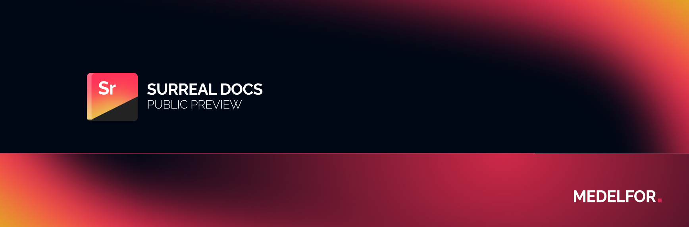
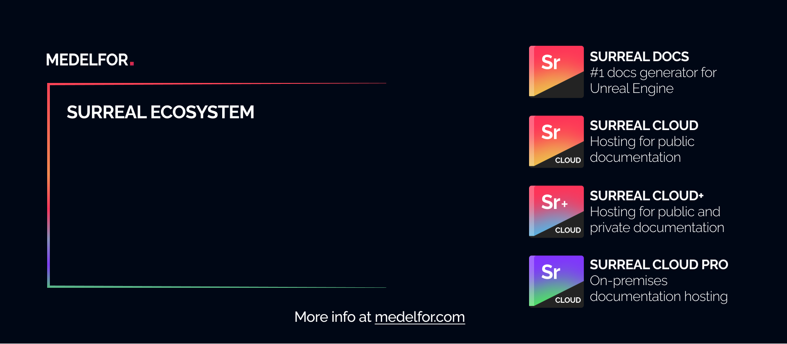

<h4 align="center">
<a href="https://github.com/medelfor/surreal-docs">Surreal Docs</a> |
<a href="https://docs.medelfor.com/medelfor/surreal-docs">Documentation</a> |
<a href="https://surrealdocs.com/medelfor/showcase-1">Live-Demo</a> | 
<a href="https://medelfor.com">Medelfor</a> |
<a href="https://store.medelfor.com">Store</a> |
<a href="https://issues.internal.medelfor.com/youtrack/issues?q=project:%20%7BSurreal%20Docs%7D">Known Issues</a> |
<a href="https://www.linkedin.com/company/medelfor/">LinkedIn</a> |
<a href="https://twitter.com/medelfor">Twitter</a>
</h4>

***

Surreal Docs is the first all-encompassing docs generation system for Unreal Engine-powered projects. It generates documentation for Unreal Engine projects, C++ and Blueprint API references in particular. It enables users to create their own custom pages using a feature-rich dialect of Markdown. Surreal Docs seamlessly integrates with our online docs hosting - Surreal Cloud, making it easy to share the docs publicly, privately with a team or within an organization. Finally, Surreal Docs perfectly understands all UE-specific C++ features, Blueprints and easily interweaves corresponding C++ and Blueprint entities in the resulting documentation! 

**This repository contains Surreal Docs Documentation - a documentation generated for Surreal Docs by Surreal Docs and available at [docs.medelfor.com](https://docs.medelfor.com/medelfor/surreal-docs "Surreal Docs documentation"). Please refer to the [main repository](https://github.com/medelfor/surreal-docs "Main Surreal Docs repository") for more info on the project.**

## Issues

If you believe there's something wrong with Surreal Docs, please create an
issue in the [main repository](https://github.com/medelfor/surreal-docs "Main Surreal Docs repository"). If you believe something is wrong with documentation, please create an issue in this repository.

## Pull requests

Please, feel free to submit your changes to the Surreal Docs Documentation in pull requests for this repository. We deeply appreciate any contributions made by
our users!

## License

Surreal Docs Documentation is covered by Surreal Docs EULA, full text of which can be
found in the `LICENSE` file.

## Surreal Ecosystem

If you need to share your docs on the internet, or privately with the team 
check out our Surreal Cloud product series which makes it easy for developers
to share their documentation with others. We've got a solution for any team,
any use case and in every price range!

[Surreal Cloud](https://medelfor.com/#surreal-cloud "Surreal Cloud") - a
serverless and auto-scaling cloud hosting for public documentation. Surreal
Cloud is the easiest way to make your documentation available to everyone on
the internet. Starts at $17/month (excl. VAT/GST).

[Surreal Cloud+](https://medelfor.com/#surreal-cloud-plus "Surreal Cloud+") -
a Medelfor's cloud for public and private documentation. Surreal
Cloud+ is the best way to share your documentation privately with your team.
Starts at $25/month (excl. VAT/GST).

[Surreal Cloud Pro](https://medelfor.com/#surreal-cloud-pro "Surreal Cloud Pro") -
the pinnacle of Surreal Cloud technology. Includes an on-premises variant
of Surreal Cloud and the online cloud for private and public documentation.
Surreal Cloud Pro is the perfect choice for companies who want to share their
documentation within the organization. Starts at $70/month (excl. VAT/GST).

Any Surreal Cloud solution integrates 100% seamlessly with Surreal Docs.

***

<h5 align="center">Thank you for using Medelfor products!</h5>
